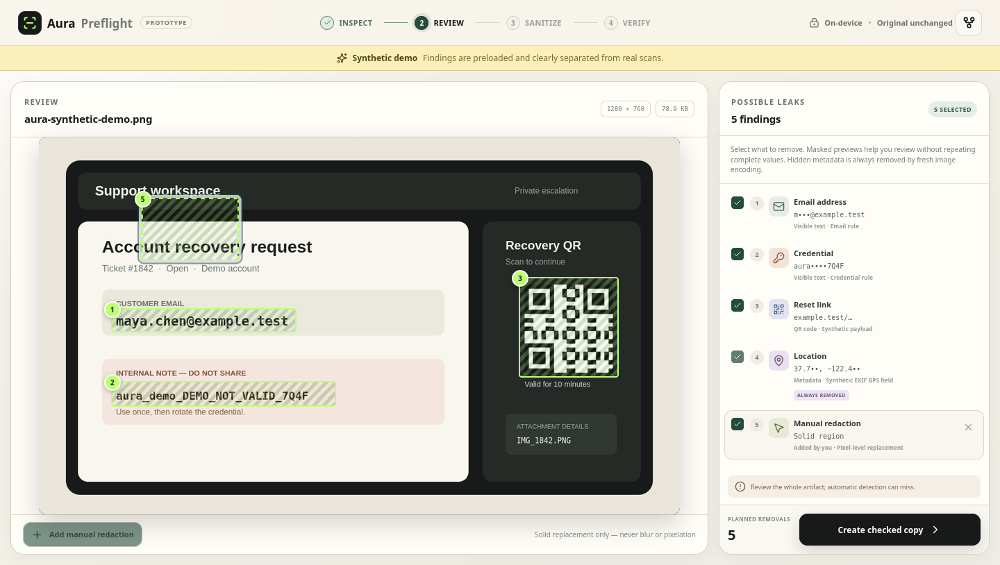
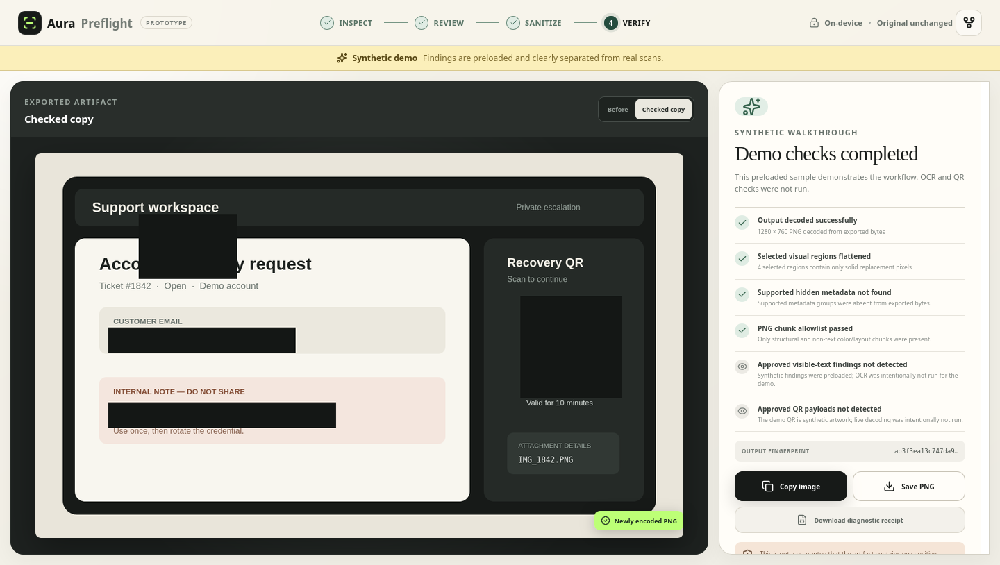

  <h1>Aura Preflight</h1>
  
<strong>Check before you share.</strong>

  

    A local-first pre-share privacy verifier for screenshots, images, and text.
    Inspect possible leaks, choose visible-content removals, export a newly
    encoded copy with supported hidden metadata stripped, then run supported
    checks against the exported bytes.
  

  

    <a href="https://nahin333.github.io/Aura/"><strong>Open the live app</strong></a>
    ·
    <a href="docs/threat-model.md">Threat model</a>
    ·
    <a href="CONTRIBUTING.md">Contribute</a>
  

  

    
    
    
  

> [!IMPORTANT]
> Aura Preflight 0.2 is a prototype, not a guarantee that an artifact is safe. Detection can miss sensitive content. Review every output before sharing it.

_Synthetic walkthrough: the findings are preloaded and labeled; this is not a live OCR/QR result._

## Why this exists

Sharing a screenshot or log can expose more than the thing you meant to show:

- visible emails, phone numbers, tokens, payment-card-like numbers, or sensitive URL parameters;
- QR payloads;
- hidden EXIF, GPS, IPTC, XMP, PNG text, ICC, or Photoshop fields;
- content missed by automatic detection.

Existing tools often stop after detection or visual masking. Aura owns a stricter workflow:

~~~text
inspect → review → sanitize → decode exported bytes → verify → receipt
~~~

The original stays untouched. Image removals are solid pixel replacement, never blur or pixelation. Output images are rendered into a fresh PNG rather than copying original compressed chunks.

The useful difference is the full contract: Aura scans the copy it actually
created, lets you match that artifact to its receipt later, and says exactly
which checks ran. OCR, metadata stripping, and a PWA by themselves are not
novel; making the whole outbound workflow reviewable and verifiable is the
product.

## Try it

Requirements: Node.js 18 or newer.

~~~bash
git clone https://github.com/nahin333/Aura.git
cd Aura
npm ci
npm run dev
~~~

Open the local URL and choose **Try the sample**. The sample is synthetic and
its findings are explicitly labeled as preloaded. Its OCR and QR
post-export checks are shown as not run.

No account, API key, backend, or cloud model is required. OCR worker, WASM core, and English model files are served from the same local build—not a CDN.

The hosted build is also installable. Offline use begins after one successful
load finishes caching the application and its packaged OCR assets.

## What works today

- Paste or drop PNG, JPEG, and WebP images up to 25 MB.
- Paste text, logs, links, or messages up to 250,000 UTF-16 code units. Aura
  fails closed above 1,000 supported matches instead of freezing an unusable
  review list.
- Add up to 20 session-only **Always hide** literal phrases for names, handles,
  internal IDs, and project terms. They stay in memory and are forgotten on
  reset.
- Replace text with opaque markers or stable readable aliases such as
  <code>[EMAIL_1]</code> and <code>[PROTECTED_1]</code>. Aura automatically
  falls back to a collision-safe opaque marker when an alias would trigger the
  same detector snapshot.
- Local English OCR with finding boxes.
- Deterministic rules for:
  - email addresses;
  - phone numbers;
  - IPv4 addresses;
  - sensitive URL query values;
  - JWT, AWS, GitHub, OpenAI, and common credential/token patterns;
  - payment-card-like numbers validated with Luhn.
- QR-code inspection with a browser-based ZXing decoder.
- EXIF, GPS, IPTC, XMP, PNG text, ICC, and Photoshop group inspection.
- User-selected visible findings, manual redaction boxes, and mandatory removal
  of supported hidden metadata on image export.
- Newly encoded PNG output with solid replacement pixels.
- A checked PNG path for reviewed images with zero supported findings; the
  receipt does not pretend pixels were redacted when none were selected.
- Post-export decode, pixel, OCR/rule, QR, metadata, and PNG-chunk checks.
- Unsigned diagnostic JSON receipts containing an output SHA-256 fingerprint,
  aggregate categories/counts and check statuses, plus image-engine versions—
  never an input fingerprint or raw detected value.
- A tested synthetic demo and real browser smoke paths.
- A local receipt matcher for exact text/PNG output bytes and both Aura v1
  receipt schemas. A match is byte correlation, not a safety proof.
- Installable offline PWA support with an exhaustive content-hashed static
  cache. User inputs and outputs are never added to that cache.
- Native share-out for passed checked copies when the browser and operating
  system expose a compatible share sheet.

_Synthetic walkthrough result: structural checks run, while OCR and QR are explicitly marked not run._

## Honest limits

- OCR and rules can miss content or produce false positives.
- English is the only packaged OCR language.
- The current QR path reports one code per scan; 1-D barcodes are not supported.
- Metadata verification covers the groups listed above plus a strict output-PNG
  chunk allowlist, not every possible proprietary or steganographic channel.
- “Export checks passed” means every listed required check ran, no approved
  finding was detected again, and no new/unreviewed supported finding appeared.
  An explicitly retained reviewed finding may remain and is disclosed.
- Diagnostic receipts are unsigned and editable; their output fingerprint can
  correlate a receipt with a known exported artifact. They are not attestations.
- Receipt matching confirms recorded bytes and metrics only. It does not prove
  the receipt is authentic or that the artifact is free of missed content.
- The local matcher accepts text artifacts up to 8 MiB and PNG artifacts up to
  192 MiB; those bounds limit browser memory use while covering valid Aura
  outputs.
- Offline availability starts only after a successful first production load.
  The packaged English OCR assets are large and may exceed tight browser
  storage quotas.
- Install prompts and native share-out depend on browser/platform support.
  Aura is not yet registered as an inbound operating-system share target.
- PDF, Office, video, audio, faces, and desktop packaging are not implemented.
- Real uploads never receive the demo's preloaded findings.

See the [threat model](docs/threat-model.md) for the exact trust boundary.

## Development

~~~bash
npm ci
npm test
npm run build
~~~

The unit suite covers detector behavior, protected literals, collision-safe
aliases, overlap resolution, destructive text replacement, receipt privacy and
matching, PWA controls, verification, and OCR punctuation repair.

For the full Firefox smoke suite, build and start the production preview in one
terminal:

~~~bash
npm run build
npm run preview
~~~

Then run:

~~~bash
AURA_BASE_URL=http://127.0.0.1:4173 npm run test:e2e
~~~

The production smoke suite covers:

1. the four-finding synthetic image flow;
2. pasted-text detection, full removal, and explicit-retention behavior;
3. repeated personal protected terms, stable aliases, and receipt privacy;
4. local artifact-to-receipt matching plus receipt-mode paste isolation;
5. manual and zero-finding image export paths with truthful receipts;
6. a real uploaded PNG with a positive OCR finding plus negative QR and
   metadata scans, rasterization, and post-export verification.

The script defaults to Ubuntu Snap paths. Override <code>FIREFOX_PATH</code>, <code>GECKODRIVER_PATH</code>, or <code>AURA_BASE_URL</code> when needed.

## Optional GitHub Pages deployment

The live app is [https://nahin333.github.io/Aura/](https://nahin333.github.io/Aura/).
The production build uses relative asset paths, including the packaged OCR
worker, WASM, and language model. After enabling **GitHub Actions** as the Pages
source in repository settings, run the **Deploy GitHub Pages** workflow from
the Actions tab. It is manual by design so a new fork does not publish
unexpectedly.

## Architecture

~~~text
src/                     React review/sanitize/verify application
src/lib/image.ts         decode, metadata/QR scan, rasterize, pixel verify
src/lib/ocr.ts           local Tesseract worker and finding-box mapping
src/lib/receipt-match.ts strict local receipt/artifact comparison
src/lib/pwa.ts           install prompt and production worker registration
packages/core/           dependency-free deterministic privacy engine
scripts/build-pwa.mjs    validated, content-hashed static service worker
scripts/e2e-smoke.mjs    complete browser smoke paths
docs/                    discovery, threat model, architecture, roadmap
~~~

The deterministic core is browser-compatible and independent of React. The
highest-leverage next extraction is a stable package API plus CLI/GitHub
Action, so the same inspect/sanitize/verify contract can protect bug reports
and automated workflows. Read the [architecture notes](docs/architecture.md)
and [changelog](CHANGELOG.md).

## Contributing

The project is designed to create meaningful contribution surfaces rather than empty forks:

- detectors with synthetic positive/negative fixtures;
- OCR normalization and language benchmarks;
- QR and metadata adversarial fixtures;
- accessible review interactions;
- translations;
- browser/platform packaging;
- threat-model and verification tests.

Start with [CONTRIBUTING.md](CONTRIBUTING.md) and the [roadmap](docs/roadmap.md). Never attach a real secret or private artifact to an issue—use synthetic replacements.

## Product direction

The product discovery and competitive desk review are recorded in
[docs/product-discovery.md](docs/product-discovery.md). The key distinction is
not “AI redaction,” generic OCR, or another metadata scrubber; it is a
transparent **inspect → review → sanitize → verify exported bytes → match
receipt** contract.

The public name is still provisional because “Aura” is heavily used by existing products.

## License

Apache-2.0. See [LICENSE](LICENSE) and [third-party notices](THIRD_PARTY_NOTICES.md).
Production builds include these files and direct runtime dependency licenses.
